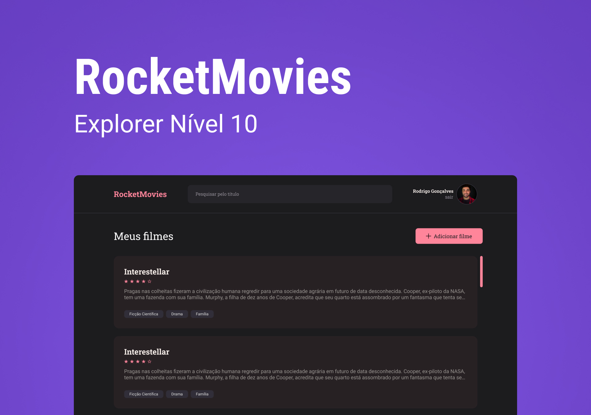

<h1 align="center">RocketMovies</h1>

  <a href="#-tecnologias">Tecnologias</a>&nbsp;&nbsp;&nbsp;|&nbsp;&nbsp;&nbsp;
  <a href="#-projeto">Projeto</a>

  

## 🚀 Tecnologias

Esse projeto foi desenvolvido com as seguintes tecnologias:

- Vite
- JavaScript
- React
- React-Icon
- React-Router-Dom
- Styled-Components
- Git e Github
- Figma

## 📑 Funcionalidades

- Cadastro
- Login
- Exibir perfil
- Atualizar perfil
- Cadastrar filmes 
- Exibir filmes cadastrados
- Detalhes dos filmes 
- Excluir filmes
- Encerrar sessão

## 💻 Projeto

O RocketMovies é uma aplicação para adicionar e detalhar sua opnião sobre algum filme.

- [Acesse o projeto finalizado, online]()

---

Feito com ♥ by Kauã :wave: